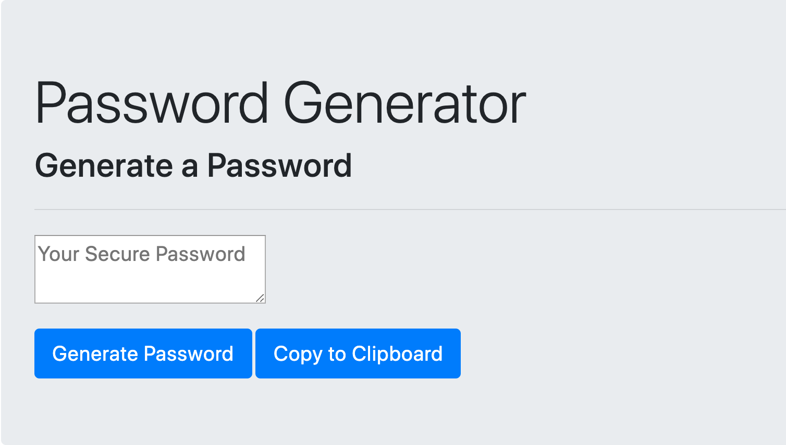

# password

Application Purpose:
The purpose of this application is to generate a random password based on the length and type of characters chosen by the user. The user clicks on "Generate Password," then responds to a prompt about the length of the password (must be between 8 and 128 characters), then answers yes/no questions about character types (special, numeric, lowercase, uppercase). A password is then generated and displays in the text area. 

Password generator:
[Click here to see the password generator!](https://shanscirg.github.io/password/)

Screenshot:

